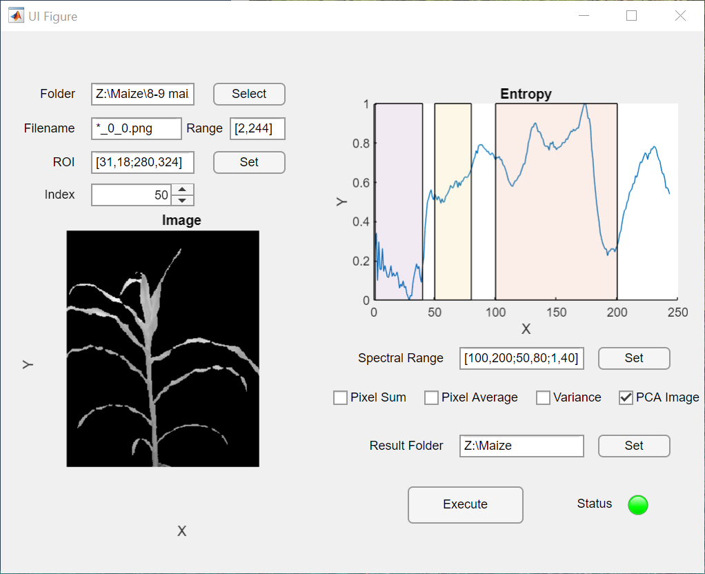

# Hyperspectral Analyzer User Guide

## Overview
Hyperspectral Analyzer is a tool used to analyze hyperspectral images.

The user interface is shown as the following figure.

## Steps to Follow

### 1. Set the Folder and File Names
- The images will be located in the directory specified in the **Folder** field. The filenames of the images are indicated in the **Filename** field, where `*` will be replaced by a number. The number will fall within the range set in the **Range** field. For example,`Image 30_0_0.png` will be used to segment the plant.

### 2. Set the ROI (Region of Interest)
- Click the **Set** button. A pop-up window will appear, allowing you to drag a box to define the ROI.
- A plot displaying the entropy of each image will be shown to help guide your selection.

### 3. Change the Current Image
- The current image can be changed by modifying the values in the spinner.

### 4. Set the Spectral Range
- If not all images are needed for processing, specific parts of the images can be selected for analysis. 
- Click the **Set** button to apply the ranges as specified in the **Spectral Range** field.
- Transparent regions will indicate the images selected for processing.

### 5. Use the Feature Checkboxes
- Select the desired features for extraction by checking the corresponding boxes.

### 6. Set the Result Folder
- Click the **Set** button to define the folder where the results will be saved.

### 7. Execute the Processing
- Click the **Execute** button to start the processing. Results will be saved in the designated result folder.

## Download
Download the MATLAB app **Hyperspectral Analyzer V1.3** (Internal Functions) [here](bin/HyperspectralAnalyzer_V1.mlappinstall).

Download the MATLAB app **Hyperspectral Analyzer V2.0** (Batch Processing & Custom Functions) [here](bin/HyperspectralAnalyzer_V2.mlappinstall).

